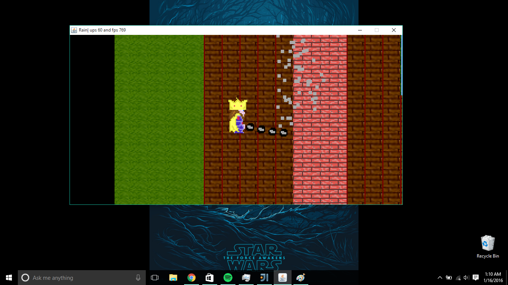
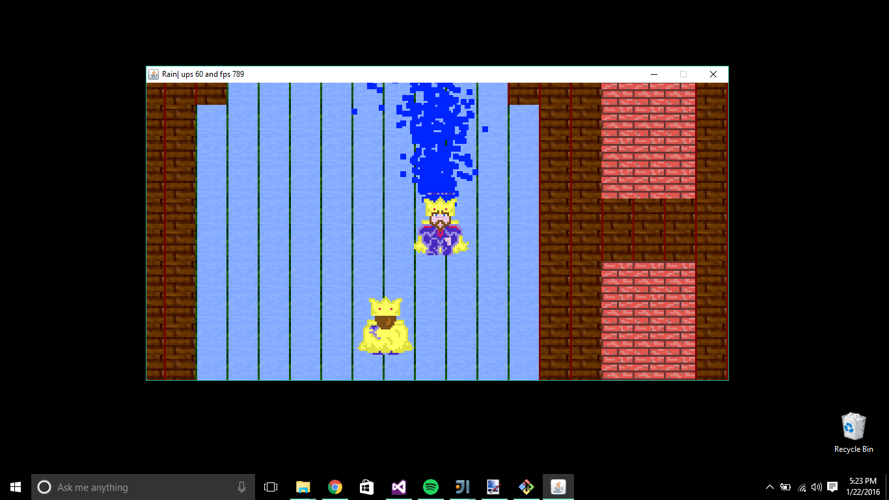

# A-Small-Little-Game-Engine
Made in Java.Coded with Love

This is a Java Game in the making.Kinda like realm of the Mad God. Having a lot of fun learning a lot about Java at the same time.
OOPS all the way

The features of this Game
#Level Rendering
Allows for the following types of Levels
Random Levels
SpriteSheet levels

#FPS Counter
Calculates fps and updates .A timer has been implemented.

#Tiles
16 by 16 tiles of various types
Rocks
Floor
Grass
Water

#Weapons and Shooting
Allows for particle/bullet creation.
#Collision Detection
Pixel Perffect Collision

#Sprites
Various sprites also the player king sprite
#Lots of Cool Stuff Coming Up
A* Search Algorithm
Mobs and NPS's

#ScreenShots

#Learnt From

I am following the brilliant course on youtube on Game Programming taught by the amazing Yan (Cherno !!).

The link is given as

#https://www.youtube.com/user/TheChernoProject
